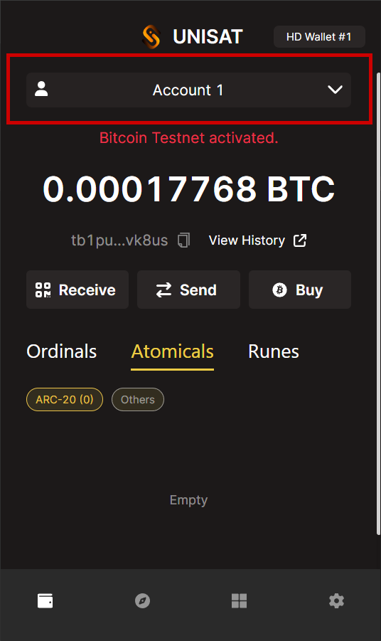
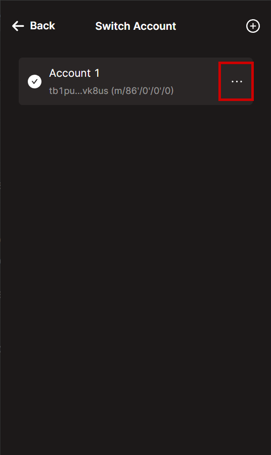
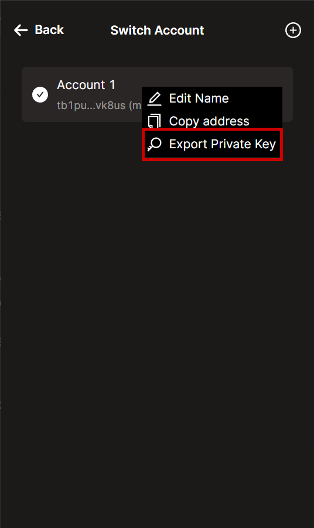

# Getting Started

This guide will help you to get started with Highlayer and build your first dApp. 

It focuses on development on the testnet, as you can obtain $tHI (testnet $HI) for free from our faucet and test your application without any financial risk.

## Wallets

Any bitcoin wallet can be used to sign Highlayer transactions, as we use [BIP322](https://github.com/bitcoin/bips/blob/master/bip-0322.mediawiki) as the signature method.

Please note that not all Bitcoin wallets can properly render Highlayer transaction data (e.g., amount, receiver, requested fee, contract id, action name, etc.).

For the testnet release of Highlayer, we use Bitcoin's testnet addresses, so make sure that your wallet supports Bitcoin's testnet.

This guide will use [Unisat](https://unisat.io/) for any wallet interactions.

> We recommend creating a new wallet without any BTC or any other form of values on it.

## Getting $tHI

To get some tBTC, obtain a Highlayer (or Bitcoin) wallet, and post your address in #faucet channel on our [discord server](https://discord.gg/skTbBz8H6S).

## Extracting WIF private key

For the library to deploy or interact with Highlayer from Node.js, you will need to obtain a WIF key from your wallet.

For Unisat, here is a series of screenshots that will help you extract the WIF key.

> IMPORTANT: Never extract and use the WIF of a high-value wallet. The WIF provides full access to your wallet, meaning if it gets compromised, you could lose all funds in the wallet. Always use a temporary, low-value wallet for development purposes.

## Next steps

After you have your wallet set up, obtained some tHI in it, and extracted and saved the WIF, you can proceed to [Writing your first dApp: Cat rating app](guide/cat-app)