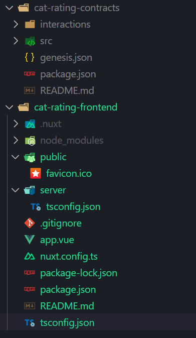

---
layout: doc
---
# Building Your First dApp

This guide will teach you how to build and deploy your first dApp on Highlayer.

> [!NOTE]
> We assume you have already followed the [Getting Started](./getting-started.md) section and have the prerequisites ready (wallet, tokens in your wallet, extracted wallet key, Node.js installed, and Highlayer-CLI installed).

## What Are We Building?

We will build an app that lets you upload a picture of your cat and allows others to rate it.

The backend for this app will be JavaScript smart contracts on the Highlayer network, and the frontend will be a Vue/Nuxt SPA app.

## Initializing the Project

Let's create a folder for our project:

```sh
mkdir cat-rating-app
cd cat-rating-app
```

Now, let's initialize two projects inside: one for the contracts and one for the frontend.

Smart contracts:
```sh
highlayer-cli init cat-rating-contracts
```

Frontend:
```sh
npx nuxi@latest init cat-rating-frontend
```

Open `cat-rating-app` in your favorite code editor, for example, VSCode:

```sh
code .
```

Let's look at the structure of our project:



Remove `tsconfig.json` and `server/tsconfig.json` as using TypeScript is out of the scope of this tutorial.

## Writing Your Contract

Now that you have initialized the contracts and the frontend, let's start coding the smart contracts.

The main entry point for your contract is located at `src/contract.js` in the `cat-rating-contracts` folder.

If you initialized your contracts properly, it should have the following code:

```js
const starter = require("./functions/starter.js");

export function onTransaction(transaction) {
  let changes = [];
  if (
    !transaction.params ||
    typeof transaction.params !== "object" ||
    typeof transaction.action !== "string"
  ) {
    ContractError("Invalid input or function not provided");
  }

  const functionMap = {
    starter: starter,
  };

  const selectedFunction = functionMap[transaction.action];
  if (!selectedFunction) {
    ContractError(`Function '${transaction.action}' not found`);
  }

  try {
    selectedFunction(transaction, changes);
    return changes;
  } catch (error) {
    ContractError(`'${transaction.action}': ${error.message}`);
  }
}
```

Let's examine it:

```js
const starter = require("./functions/starter.js");
```

This bit loads `src/functions/starter.js` into the `starter` variable.

```js
export function onTransaction(transaction) {
  ...
}
```

This is your main transaction handler. When someone calls your smart contract, the `onTransaction` function gets called, similar to the "main" function in traditional programs.

We recommend routing based on `transaction.action`, which is an arbitrary user-provided string, like a URL in web servers.

The code from the default template performs basic routing:

```js
  let changes = [];
  if (
    !transaction.params ||
    typeof transaction.params !== "object" ||
    typeof transaction.action !== "string"
  ) {
    ContractError("Invalid input or function not provided");
  }

  const functionMap = {
    starter: starter,
  };

  const selectedFunction = functionMap[transaction.action];
  if (!selectedFunction) {
    ContractError(`Function '${transaction.action}' not found`);
  }

  try {
    selectedFunction(transaction, changes);
    return changes;
  } catch (error) {
    ContractError(`'${transaction.action}': ${error.message}`);
  }
```

Note the `changes` array and the `return` statement (which returns `changes`).

The `onTransaction` function must return an array of [Actions](/general-documentation/common-data-types.md#action), which are elementary operations of Highlayer performing some action, such as writing to the Key-Value store, calling another contract, emitting an event, etc.

Collecting actions to execute into the `changes` array and then returning it is a good practice to keep the code clean.

### Implementing the Cat Rating System in the Smart Contract

Now that you're a bit familiar with the smart contract structure, we can implement the cat rating system.

We will need the following functions: `add-cat`, `remove-cat`, `upvote`, `downvote`.

Let's start by setting up routing for these functions in `contract.js`:

```js
const addCat = require("./functions/add-cat.js");
const removeCat = require("./functions/remove-cat.js");
const upvote = require("./functions/upvote.js");
const downvote = require("./functions/downvote.js");

export function onTransaction(transaction) {
  let changes = [];
  if (
    !transaction.params ||
    typeof transaction.params !== "object" ||
    typeof transaction.action !== "string"
  ) {
    ContractError("Invalid input or function not provided");
  }

  const functionMap = {
    "add-cat": addCat,
    "remove-cat": removeCat,
    "upvote": upvote,
    "downvote": downvote
  };

  const selectedFunction = functionMap[transaction.action];
  if (!selectedFunction) {
    ContractError(`Function '${transaction.action}' not found`);
  }

  try {
    selectedFunction(transaction, changes);
    return changes;
  } catch (error) {
    ContractError(`'${transaction.action}': ${error.message}`);
  }
}
```

Now, let's talk about adding cats. Usually, you would store cat profiles in some sort of database, and it's no different in Highlayer. Let's store our cat data in Highlayer's Key-Value store.

To store a value in Highlayer's KV store, you need to return a [kvStore](/general-documentation/system-actions.md#kvstore) action.

Since we have implemented it through `changes`, we can just push an action that stores a value into our `changes` array:

```js
changes.push({
    program: "system",
    action: "kvStore",
    params: {
        key: "myKey",
        value: "myValue"
    }
});
```

However, writing this each time you need to store something isn't pleasant, so Highlayer's VM exposes the `KV.set(key, value)` function, which acts as syntactic sugar that expands into a full action object.

Meaning we can do the following:

```js
changes.push(KV.set("myKey", "myValue"));
```

Note that while the key can only be a string, the value can be any primitive JavaScript value: array, integer, object, etc.


#### Implementing `add-cat` function
Let's store our cats in an array linked to a KV entry.

Assume our cats have the fields `owner`, `picture`, `description`, `name`, `upvotes`, and `downvotes`.

Here's the `add-cat` code that would implement this:

```js
module.exports = (transaction, changes) => {
    // ContractAssert ensures that a statement is true, otherwise stops execution of the contract
    ContractAssert(typeof transaction.params.picture === 'string', "Invalid picture URL");
    ContractAssert(typeof transaction.params.description === 'string', "No description provided");
    ContractAssert(typeof transaction.params.name === 'string', "No name provided");
    ContractAssert(transaction.params.name.length < 20, "Name is too long");

    let catsArray = KV.get('cats') || []; // KV.get(key) allows us to instantly get value from the KV store.
    
    catsArray.push({
        name: transaction.params.name,
        description: transaction.params.description,
        picture: transaction.params.picture,
        owner: transaction.sender,
        upvotes: [],
        downvotes: []
    });

    changes.push(KV.set('cats', catsArray));
}
```

Save this code into `src/functions/add-cat.js` and proceed with writing `remove-cat`.

#### Implementing `remove-cat` function

Let's implement the `remove-cat` function. This will allow users to remove a cat from the rating system by its index. We want to make sure only the owner of the cat can remove it. Instead of removing the cat and messing up the order, we'll replace the cat's data with `null`.

Here's the code:

```js
module.exports = (transaction, changes) => {
    ContractAssert(typeof transaction.params.index === 'number', "Invalid cat index");

    let catsArray = KV.get('cats') || [];

    ContractAssert(transaction.params.index >= 0 && transaction.params.index < catsArray.length, "Cat not found");
    ContractAssert(catsArray[transaction.params.index] && catsArray[transaction.params.index].owner === transaction.sender, "Only the owner can remove the cat");

    catsArray[transaction.params.index] = null;

    changes.push(KV.set('cats', catsArray));
}
```

Save this code into `src/functions/remove-cat.js`.

By replacing the cat's data with `null` instead of removing it, we keep the indexes of the remaining cats untouched. 

#### Implementing `upvote` and `downvote` Functions

Now, let's add the voting functions so users can upvote or downvote a cat. Each user can vote only once per cat.

We will want to remove opposite vote and avoid duplication of current one.

Here's the code for the `src/functions/upvote.js` function:

```js
module.exports = (transaction, changes) => {
    ContractAssert(typeof transaction.params.index === 'number', "Invalid cat index");

    let catsArray = KV.get('cats') || [];
    let cat = catsArray[transaction.params.index];
    ContractAssert(cat, "Cat not found");
    ContractAssert(!cat.upvotes.includes(transaction.sender), "You have already upvoted this cat");

    cat.upvotes = cat.upvotes.filter(voter => voter !== transaction.sender);
    cat.downvotes = cat.downvotes.filter(voter => voter !== transaction.sender);
    cat.upvotes.push(transaction.sender);

    changes.push(KV.set('cats', catsArray));
}
```
Respectively, the code for `src/functions/downvote.js` is much the same, with exception of pushing vote into downvotes array instead of upvotes:

```js
module.exports = (transaction, changes) => {
    ContractAssert(typeof transaction.params.index === 'number', "Invalid cat index");

    let catsArray = KV.get('cats') || [];
    let cat = catsArray[transaction.params.index];
    ContractAssert(cat, "Cat not found");
    ContractAssert(!cat.upvotes.includes(transaction.sender), "You have already upvoted this cat");

    cat.upvotes = cat.upvotes.filter(voter => voter !== transaction.sender);
    cat.downvotes = cat.downvotes.filter(voter => voter !== transaction.sender);
    cat.downvotes.push(transaction.sender);

    changes.push(KV.set('cats', catsArray));
}
```

Now you've just wrote your first highlayer smart contract!

You can build it by running 
```sh
npm install
highlayer-cli build
```
Don't forget to cd into `cat-rating-contracts`

And then running following command to deploy your built contract. 
```sh
highlayer-cli deploy --actions genesis.json
```
You should get output similar to following (but with different source and contract IDs):

```
✅ Contract Src ID: 88ff7ccceaf4e7b1c48442adfc81c33752ac5556c8b408a44c77aaa31d7ae6d801
✅ Contract ID: hlcontract1qmf23f6lc4ydmk2cv99xtxyyj4fd6dlr3zhw8q9ynskfu4ahm6qjs5kx7k6
```

Write down these values somewhere, you will need it when impementing frontend.


